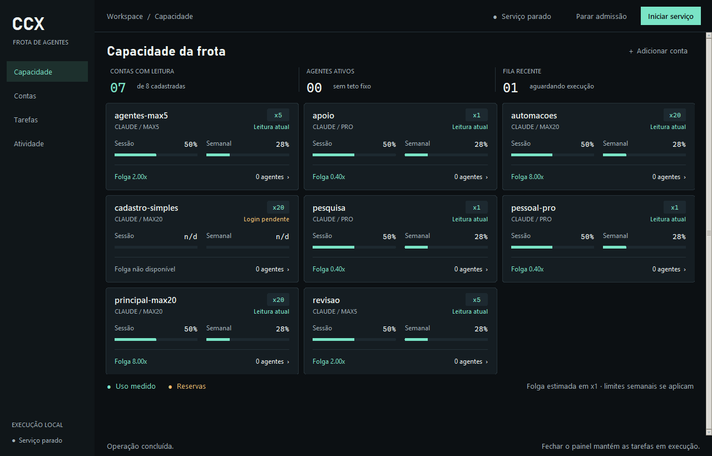

# CCX

**Frota local de agentes Claude Code e Codex, com contas isoladas e capacidade ponderada.**

[English](README.md) · [Guia da frota](docs/features/fleet.md) · [Skill](skills/README.md) · [Migração](docs/runbooks/migration.md)



Pro x1, Max 5 x5 e Max 20 x20 não têm a mesma capacidade com o mesmo percentual.
O CCX escolhe a conta antes de executar, reserva capacidade e mantém um perfil
independente por agente simultâneo. Sem teto numérico de agentes: cota, perfis
livres e conflito de escrita determinam a admissão.

## Começar

Windows, Python 3.12+ com Tkinter e os CLIs oficiais no PATH. Sem dependência de
runtime via pip. Abra `ccx-panel.cmd`, cadastre nome/provedor/plano e faça login.
O ícone da bandeja abre/oculta a janela. Serviço e agentes continuam funcionando
com o painel fechado; não há instalação automática de início com o Windows.

```sh
python ccx-fleet.py status
python ccx-fleet.py cell add conta-a claude --plan max5
python ccx-fleet.py cell login conta-a
python ccx-fleet.py run claude --cell conta-a --prompt-file tarefa.md --cwd C:/projetos/app --request-id revisao-001 --timeout 900
python scripts/install-skill.py both
```

Sem `--cell`, o escalonador escolhe. A permissão padrão é somente leitura.
Timeout de espera preserva o trabalho: guarde o ID para esperar ou cancelar.
Cada cadastro cria um worker; outro agente simultâneo nessa conta precisa de
outro worker autenticado. Peso semanal padrão 1, margem 10% e custo estimado 15.

A tela principal acompanha a capacidade das contas. Tarefas são enviadas pelo
CLI/integrações, sem formulário de criação no painel. Leia a skill antes de
invocar outros agentes. A skill não altera a conta da IDE nem roteia seus
subagentes nativos automaticamente.

O modelo antigo de rotação global está em compatibilidade. Desative hooks,
monitor e bridge conforme o [runbook](docs/runbooks/migration.md); não apague os
módulos Python compartilhados com a frota. Nunca copie tokens entre perfis.

Validação: `python scripts/check.py`. Detalhes, limites e contribuição no
[README principal](README.md). Licença [MIT](LICENSE).
