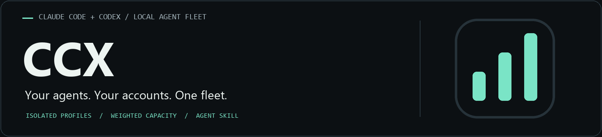

<p align="center">
  
</p>

<h1 align="center">CCX</h1>

<p align="center"><strong>Seus agentes, distribuídos entre suas contas. Capacidade que considera cada plano.</strong></p>

<p align="center">
  <a href="#começar">Instalar</a> ·
  <a href="#veja-o-painel">Painel</a> ·
  <a href="#skill-para-agentes">Skill para agentes</a> ·
  <a href="docs/features/fleet.md">Guia da frota</a> ·
  <a href="https://syntaxlab.com.br">SyntaxLab</a> ·
  <a href="README.md">English</a>
</p>

<p align="center">
  <a href="https://github.com/thalesholleben/ccx/actions/workflows/tests.yml"></a>
  <a href="LICENSE"></a>
  <a href="#começar"></a>
  <a href="#começar"></a>
  <a href="#skill-para-agentes"></a>
</p>

O CCX gerencia uma frota local de contas Claude Code e Codex. Cadastre nome,
provedor e plano, faça login pelo CLI oficial e deixe o escalonador escolher uma
conta para cada tarefa conforme limites medidos, pesos dos planos e capacidade
reservada. O painel compacto acompanha a frota; o serviço de execução continua
funcionando quando você fecha a janela.

**A skill para agentes faz parte do produto.** Distribuída com o CCX e instalável
no Claude Code e no Codex, ela ensina os agentes a consultar limites, respeitar
margens, escolher a conta e despachar trabalho por perfis isolados. É a ligação
entre a decisão do agente, os comandos do CLI e o escalonador.
[Instale a skill](#skill-para-agentes).

## Veja o painel


*Captura da aplicação real no Windows, usando contas sintéticas. Nenhum dado de
conta real ou credencial aparece aqui.*

Claude: Pro x1, Max 5 x5 e Max 20 x20. Codex: Plus x1 e Pro x5, sem opção Pro x20.
Esses perfis não têm a mesma capacidade com o mesmo percentual.
O CCX escolhe a conta antes de executar, reserva capacidade e mantém um perfil
independente por agente simultâneo. Sem teto numérico de agentes: cota, perfis
livres e conflito de escrita determinam a admissão.

## Skill para agentes

A [skill CCX](skills/ccx/SKILL.md) orienta o agente a lê-la **antes de delegar
trabalho**. Ela explica os comandos, o funcionamento interno, os limites e as
estratégias de escolha de conta, considerando a folga ponderada, as margens e
os limites semanais ou por modelo. Ensina também a preservar permissões e
isolamento, acompanhar tarefas e tratar timeout sem duplicar a execução.

```sh
python scripts/install-skill.py both
```

Atualize a sessão do agente após instalar. A skill distribuída é genérica;
preferências do operador ficam no `references/local.md` instalado. Consulte o
[guia da skill](skills/README.md) para caminhos e integração com runners.

## Começar

Windows, Python 3.12+ com Tkinter e os CLIs oficiais no PATH. Sem dependência de
runtime via pip. Abra `ccx-panel.cmd`, cadastre nome/provedor/plano e faça login.
O nome é um label editável em **Editar conta**. O ID é gerado automaticamente;
use o ID mostrado no cadastro no lugar de `ID_DA_CONTA` nos comandos.
O ícone da bandeja abre/oculta a janela. Serviço e agentes continuam funcionando
com o painel fechado; não há instalação automática de início com o Windows.

```sh
python ccx-fleet.py status
python ccx-fleet.py cell add conta-a claude --plan max5
python ccx-fleet.py cell login ID_DA_CONTA
python ccx-fleet.py run claude --cell ID_DA_CONTA --prompt-file tarefa.md --cwd C:/projetos/app --request-id revisao-001 --timeout 900
python scripts/install-skill.py both
```

Sem `--cell`, o escalonador escolhe. A permissão padrão é somente leitura.
Timeout de espera preserva o trabalho: guarde o ID para esperar ou cancelar.
Cada cadastro cria um worker; outro agente simultâneo nessa conta precisa de
outro worker autenticado. Peso semanal padrão 1, margem 10% e custo estimado 15.

A tela principal acompanha a capacidade das contas. Tarefas são enviadas pelo
CLI/integrações, sem formulário de criação no painel. Leia a skill antes de
invocar outros agentes. A skill não altera a conta da IDE nem roteia seus
subagentes nativos automaticamente.

A rotação global, os hooks e o bridge antigos foram aposentados. Desative hooks,
monitor e bridge conforme o [runbook](docs/runbooks/migration.md); não apague os
módulos Python compartilhados com a frota. Nunca copie tokens entre perfis.

Validação: `python scripts/check.py`. Detalhes, limites e contribuição no
[README principal](README.md). Licença [MIT](LICENSE).

## Consulta rápida no terminal

`python ccx.py stats` mostra até três contas por linha, Claude em cima e Codex
embaixo, com os limites de sessão e semana. Amarelo a partir de 70%, vermelho a
partir de 90%. Terminais estreitos usam uma ou duas colunas. `cache` indica leitura
com mais de dez minutos; `n/d`, janela não informada pelo provedor. Use `--refresh`
para medir perfis ociosos, `--details` para diagnóstico e `--json` para integrações.
